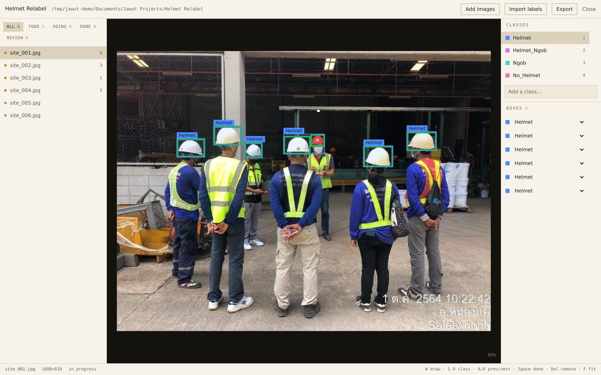
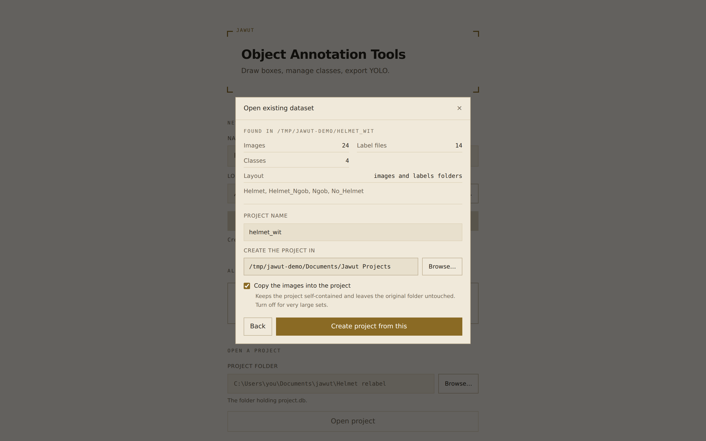
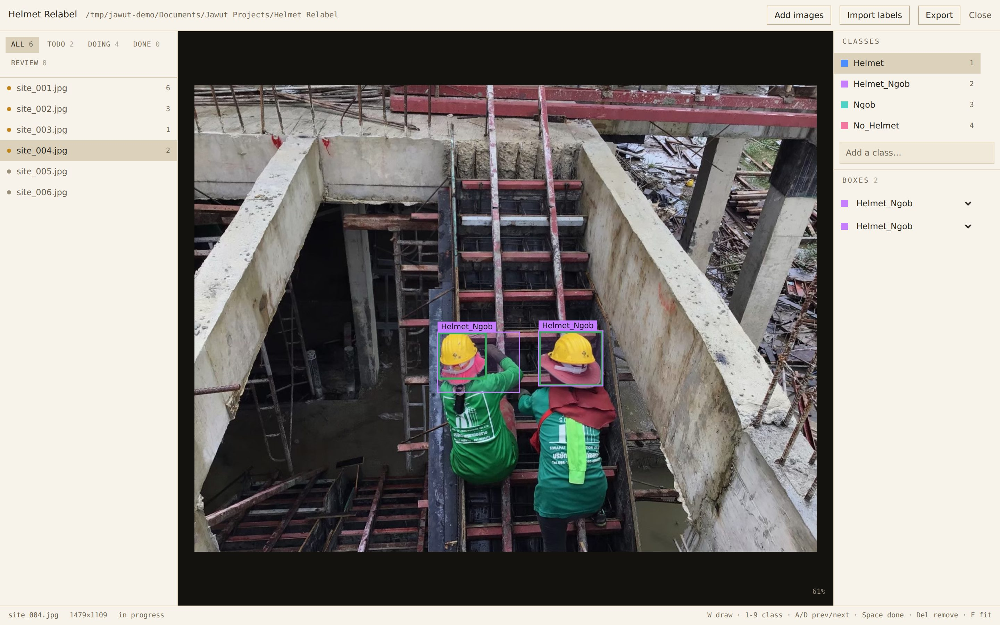

# Jawut Object Annotation Tools

**A Windows desktop app for drawing bounding boxes and exporting YOLO datasets.**
One folder, one executable. No Python, no database, no installer, no account, no internet.

[**Download for Windows →**](../../releases/latest) · [User Guide (PDF)](docs/USER_GUIDE.pdf)



Built for the job most labeling tools handle badly: **finishing a dataset somebody already
started.** Point it at a folder of images that is partly labeled, with class names in a
`data.yaml` and half the `.txt` files missing, and it works out what is there and picks up from
where the last person stopped.

It runs entirely on your own machine. The application starts a small server bound to
`127.0.0.1`, shows it in a native window, and shuts down when you close it. Nothing is uploaded,
nothing is tracked, and it works with no network connection at all.

## Why it exists

Retagging an existing dataset usually means writing throwaway scripts: renumber the classes,
work out which images were never checked, avoid destroying the ones that were deliberately left
empty, then re-split it. Every one of those steps is somewhere a dataset quietly gets corrupted.

This does all of it in the interface, and refuses to guess where guessing would be wrong.

| The trap | What this does |
|---|---|
| An image with no `.txt` and an image with an empty `.txt` get treated the same | They are tracked separately. Missing means *nobody looked*; empty means *someone looked and there was nothing there* — a valid background image. Export handles them differently |
| Deleting a class silently shifts every class index after it | Classes carry stable IDs. The YOLO integer is derived at export time, so deleting one cannot renumber your labels |
| A malformed label line gets dropped without telling you | Only unambiguous problems are auto-repaired (pixel coordinates, rounding overflow). Everything else is quarantined and listed with its file and line number |
| A rare class lands entirely in one split and its validation score means nothing | Splits are stratified on each image's rarest class, with a fixed seed and a manifest recording exactly what went where |

## Features

- **Open an existing dataset in one step** — browse to a folder and it detects the layout
  (`images`/`labels`, Ultralytics `train`/`valid`/`test`, or one flat folder), reads the class names
  from `data.yaml`, and builds the project with images, classes and labels already in place
- **Native folder pickers** everywhere a path is needed — no typing Windows paths
- **Bounding-box labeling** with zoom, pan, edge-handle resize, and a keyboard-first workflow
- **Import what you already have** — images alone, or images plus YOLO `.txt` labels and a
  `data.yaml`, with a mapping step so your class names land where you intend
- **Resume partial work** — every image tracks whether it is untouched, in progress, finished, or
  flagged for review, and the list can be filtered accordingly
- **Safe class editing** — add, rename, reorder or delete classes at any time, including reassigning
  every box of a class to another class, without corrupting existing annotations
- **YOLO export** — stratified train/val/test split with a fixed seed, or a flat unsplit export,
  with `data.yaml` written for you

## Install

1. Download the latest zip from [**Releases**](../../releases/latest)
2. Extract it anywhere — your Desktop is fine
3. Run **`Jawut Object Annotation Tools.exe`**

Nothing else is required. Windows 10 or 11, 64-bit.

### Windows will warn you the first time. It is not a virus warning.

You will see a blue box: **"Windows protected your PC — Microsoft Defender SmartScreen prevented
an unrecognised app from starting."**

> Click **More info** (the small link, easy to miss), then **Run anyway**. Windows only asks once.

**This is not Windows telling you the file is harmful.** It is Windows telling you it does not
recognise the *publisher*. Windows trusts applications that carry a **code-signing certificate** —
a paid identity certificate that costs a few hundred dollars a year. This one does not have one,
so every new build looks unknown to SmartScreen regardless of what it contains. A brand-new
program from a small team always looks like this on day one.

If you would rather verify than trust:

- **It cannot phone home.** The server binds to `127.0.0.1` on an OS-assigned port, so nothing
  outside your own machine can reach it, and it exits when the window closes.
- **It only touches folders you pick.** Your images, your project folder, your export destination.
- **Every release is built by CI from this repository**, not uploaded from someone's laptop — see
  [`.github/workflows/release.yml`](.github/workflows/release.yml). The build is smoke-tested on a
  clean Windows runner before it is published.
- The whole source is here to read.

### If it will not start at all

Windows has flagged the downloaded files. Extracting a downloaded zip with Explorer's **Extract
All** copies the "came from the internet" mark onto every file inside, and Windows then refuses to
load some of them — so the application starts and immediately dies with no window.

The app clears that mark from its own files at startup, so this should not happen. If it does:

- Right-click the **folder you extracted** → **Properties** → tick **Unblock** → **OK**
- Or, in PowerShell:
  ```powershell
  Get-ChildItem "path\to\Jawut-Object-Annotation-Tools-...-windows" -Recurse | Unblock-File
  ```
- Extracting with 7-Zip instead of Explorer avoids it entirely.

If the window still cannot open, the app offers to run in your browser instead rather than
failing — everything works there except the **Browse…** buttons, which no web page is allowed to
provide.

## Documentation

| | |
|---|---|
| **[User Guide](docs/USER_GUIDE.md)** ([PDF](docs/USER_GUIDE.pdf)) | Every step with screenshots, from a blank screen to an exported dataset. Start here. |
| [Migration runbook](docs/HELMET_MIGRATION.md) | Relabeling an existing dataset onto a new set of classes. |

## Getting started

**If you already have a dataset**, choose **Open existing dataset**, browse to the folder, and
confirm what it found. Images, classes and existing labels arrive together; images with no `.txt`
stay marked untouched rather than empty.



Class names come from your `data.yaml` and are created in the same order, so the integer in every
`.txt` keeps its meaning. Nothing in the source folder is modified.

**If you are starting from photographs:**

1. Launch the app and choose **New project**, then pick a name and a folder to keep it in.
2. **Add images** — browse to a folder. Images are copied into the project by default, so the
   project folder stays self-contained and can be moved or backed up by copying it.
3. **Add labels** (optional) — browse to a folder of YOLO `.txt` files and, if you have one, a
   `data.yaml`. Map each incoming class to a project class, then review the import report.
4. Label. Press `W` to draw a box, a number key to set its class, `D` for the next image.
5. **Export** when done, choosing a split or a flat layout.

### Labeling



Boxes are drawn with a dark outline under the class colour, so they stay visible against a bright
sky and dark mud alike — the default palette is chosen to avoid the colours of dirt, vegetation
and machinery, which is where box colours usually disappear on site photographs.

### Keyboard

| Key | Action | Key | Action |
|---|---|---|---|
| `W` | new box | `A` / `D` | previous / next image |
| `1`–`9` | set class of the selected box | `Space` | mark done and advance |
| `F` | fit image to window | `Delete` | delete selected box |
| `Esc` | cancel drawing / deselect | | |

## Where your data lives

| What | Where |
|---|---|
| Application settings, recent projects | `%APPDATA%\Jawut\` |
| Projects | The folder you choose, default `Documents\Jawut Projects\<name>\` |

A project folder holds `project.db` — every annotation, class and status — plus an `images/` copy.
Back it up by copying the folder.

## Export format

Standard YOLO detection labels: one `.txt` per image, one line per box,
`<class_index> <cx> <cy> <w> <h>` with all coordinates normalized to `[0,1]`, alongside a
`data.yaml` listing the class names.

An image that has been reviewed and genuinely contains no objects exports an **empty** `.txt` — a
valid background image. Images never opened are excluded by default; a checkbox includes them.

Split exports also write `export_manifest.json` recording the seed, ratios and per-image split
assignment, so the same export can be reproduced later.

## License

MIT — see [`LICENSE`](LICENSE).

## Citing

If Jawut helped you build or fix a dataset, please cite it:

```
Kowcharoen, E. (2026). Jawut Object Annotation Tools (Version 0.4.0) [Computer software].
https://github.com/EkasithK/jawut-object-annotation-tools
```

A machine-readable entry is in [`CITATION.cff`](CITATION.cff).

## Building from source

Requires Python 3.11+, [uv](https://github.com/astral-sh/uv), and Node 20+.

```bash
uv sync
cd frontend && npm install && npm run build && cd ..

# run in development (two processes)
uv run uvicorn jawut.app:app --reload --port 8000
cd frontend && npm run dev          # proxies /api to :8000

# tests, lint, types
uv run pytest tests/ -v --cov=src --cov-report=term-missing
uv run ruff check . && uv run mypy src/
```

The Windows executable is produced by the release workflow on a Windows runner; PyInstaller cannot
cross-compile, so building it locally requires Windows.
