# Jawut Object Annotation Tools — User Guide

Draw boxes on images, manage your classes, export a YOLO dataset.

This guide walks through the whole job from a blank screen to a training-ready
dataset. The screenshots are from a real session on real site photographs.

---

## Before you begin

Download the zip from the project's Releases page, extract it anywhere, and run
**Jawut Object Annotation Tools.exe**.

Nothing else is needed. No Python, no database, no installer. The whole application
is inside that folder.

### Windows will warn you. That is expected, and it is not a virus warning.

The first time you run it, Windows shows a blue box saying **"Windows protected
your PC — Microsoft Defender SmartScreen prevented an unrecognised app from
starting"**.

**This does not mean anything is wrong with the application.** To run it:

1. Click **More info** (the small link in the blue box — it is easy to miss)
2. Click **Run anyway**

That is all. Windows remembers your choice, so it only asks once.

**Why it happens.** Windows trusts programs that carry a *code-signing
certificate* — a paid identity certificate bought from a certificate authority
for a few hundred dollars a year. This application does not have one. That is the
entire reason for the warning: it is Windows saying "I do not recognise the
publisher of this file", not "I found something harmful in this file". A brand-new
program from a small team looks exactly like this to Windows on day one, whether
it is safe or not.

What you can check for yourself, if you want to:

- The application makes **no internet connection at all** — it runs a small server
  on your own machine, bound to `127.0.0.1`, which nothing outside your computer
  can reach. It closes when you close the window.
- It only reads and writes the folders you point it at.
- The whole source is in this repository, and every release is built from it
  automatically by GitHub Actions rather than uploaded from someone's laptop.

If your workplace blocks it entirely, that is usually Windows marking the
downloaded file. Right-click the zip → **Properties** → tick **Unblock** → **OK**,
then extract it again.

---

## Step 1 — The welcome screen

When the application opens for the first time you see this. There is nothing here
yet because you have not made a project.

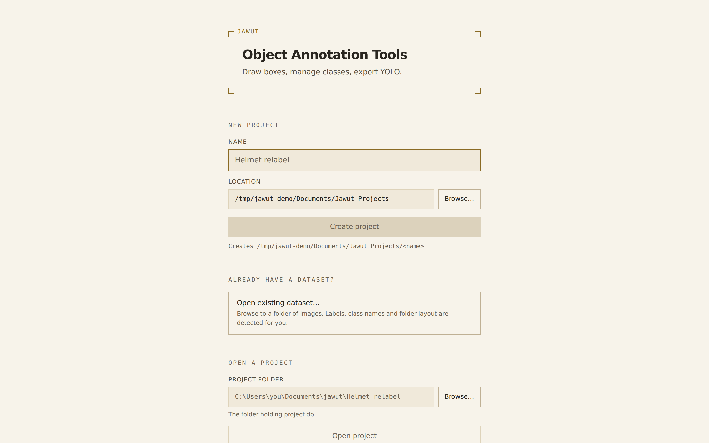

A **project** is one labeling job: a set of images, the classes you are using, and
every box you draw. You can have as many as you like, and they never interfere with
each other.

There are three ways in, and which one you want depends on what you already have:

| You have | Use |
|---|---|
| Photographs and nothing else | **New project** |
| A folder of images that is already partly or fully labeled | **Open existing dataset** |
| A project you made before | **Recent**, or **Open project** |

**You never have to type a path.** Every box that asks for a folder has a
**Browse…** button beside it that opens the ordinary Windows folder chooser. The
box stays typeable if you would rather paste a path in.

---

## Step 1a — If you already have a dataset

This is the fastest route for anyone handed a folder from a previous tool, a
colleague, or an earlier attempt. Click **Open existing dataset…** and browse to the
folder.

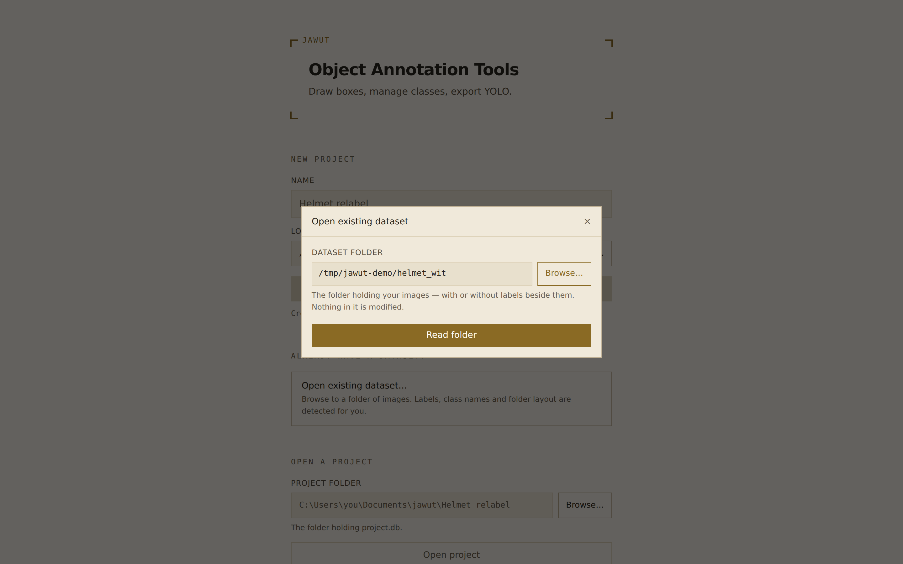

Pick the folder that *contains* your images — not the `images` folder inside it, if
there is one. The application works out the rest.


Before anything is created, it tells you what it found: how many images, how many
already have labels, how the folder is arranged, and the class names. It recognises

- `images` and `labels` folders side by side,
- Ultralytics `train` / `valid` / `test` splits,
- images and their `.txt` files together in one folder.

**Class names come from your `data.yaml`.** This is what stops you looking at
`0, 1, 2, 3` and having to remember which was which — the names are read from the
config and created in the same order, so the number in every `.txt` file still means
exactly what it meant before. If there is no `data.yaml`, the classes arrive as
`class_0`, `class_1`, … and you can rename them afterwards without touching a single
label.

Then click **Create project from this**. Images, classes and existing labels all come
in at once, and images that had no label file stay marked as **not yet looked at** —
which is not the same as "checked and empty", and matters at export time.

**Nothing in your original folder is modified.** With *Copy the images into the
project* left on, the images are copied, and the source is only ever read.

---

## Step 2 — Make a project from scratch

If you are starting with photographs and no labels: type a name, click **Browse…**
to choose where it goes, and click **Create project**.

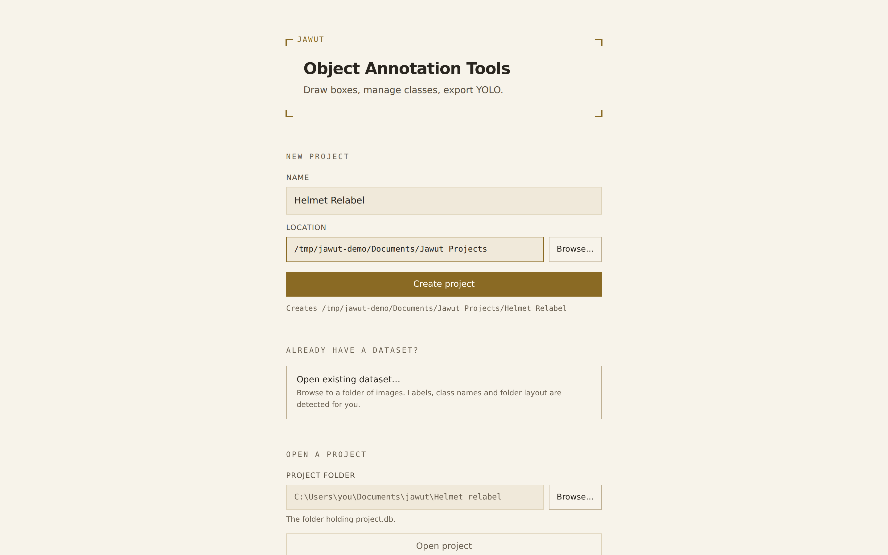

The grey line under the button shows exactly which folder will be created, so there
is no guessing.

**Where your work lives.** A project is a plain folder containing a `project.db`
file and a copy of your images. To back it up, copy the folder. To move it to
another computer, copy the folder. There is nothing else to keep track of.

---

## Step 3 — The workspace

The project opens. It is empty, which is expected — there are no images yet.

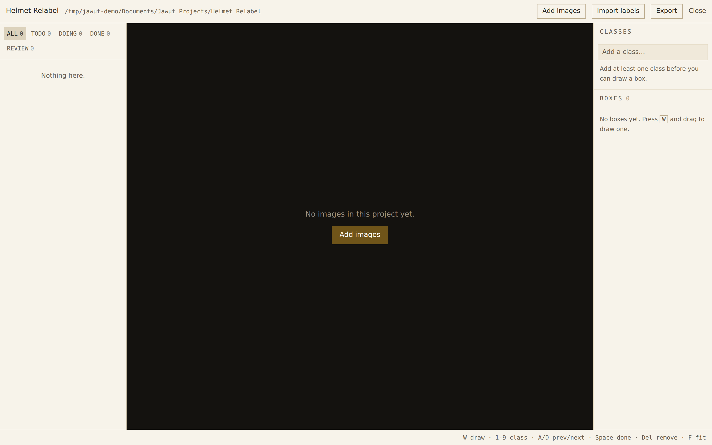

The layout stays the same throughout:

| Area | What it holds |
|---|---|
| **Left** | Every image, with a coloured dot for its state, and filters along the top |
| **Middle** | The image you are working on |
| **Right** | Your classes on top, the boxes on the current image below |
| **Bottom** | The current file, its size, its state, and the keyboard shortcuts |

---

## Step 4 — Add your images

Click **Add images**, then **Browse…** to the folder your photographs are in.

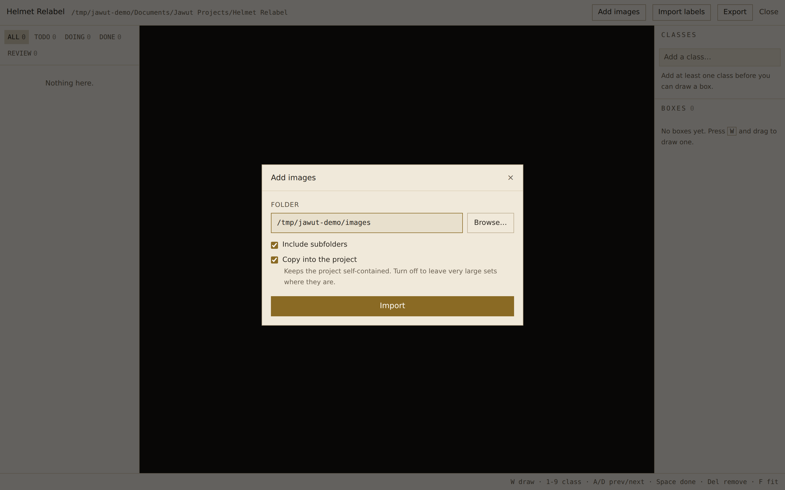

Two options are worth understanding:

- **Include subfolders** — on by default. Finds images in folders inside the folder
  you chose.
- **Copy into the project** — on by default, and worth leaving on. Your photographs
  are copied into the project, so the project folder is self-contained. Moving or
  reorganising your original photo folders later cannot break it. Turn it off only
  for very large sets you do not want to duplicate on disk.

Click **Import**. You get a report:

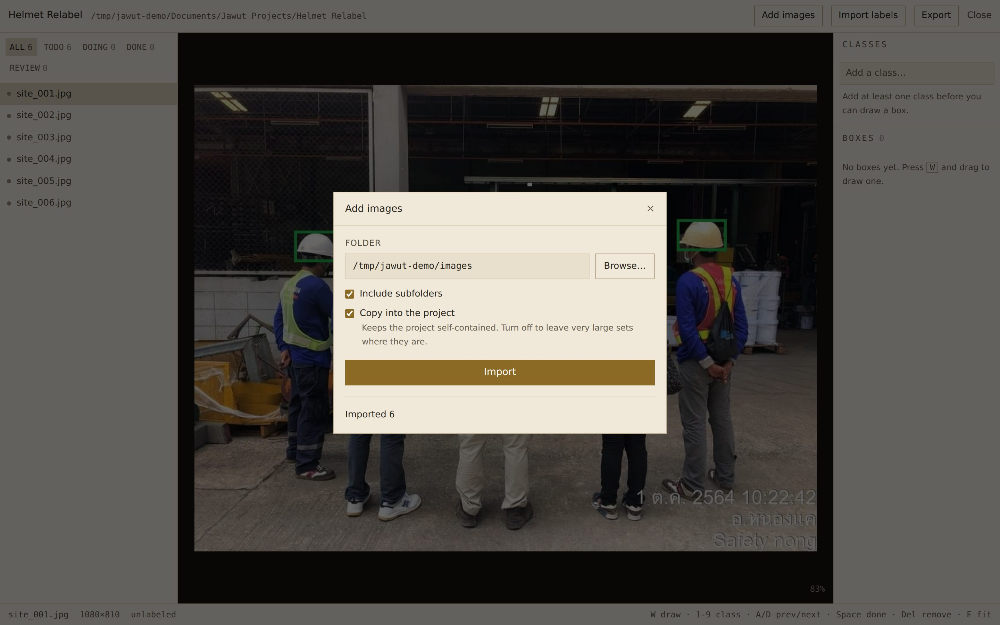

Read this before moving on. It tells you how many images came in, how many were
already in the project, and how many were **skipped** — each with the reason.
A skipped image is usually a damaged file, which is much better to know now than
halfway through labeling.

**The same photograph cannot be imported twice.** The application compares file
contents, not names, so importing the same folder again adds nothing.

---

## Step 5 — Set up your classes

A class is a category you are labeling — a kind of object. Type a name in
**Add a class…** on the right and press Enter. Repeat for each one.

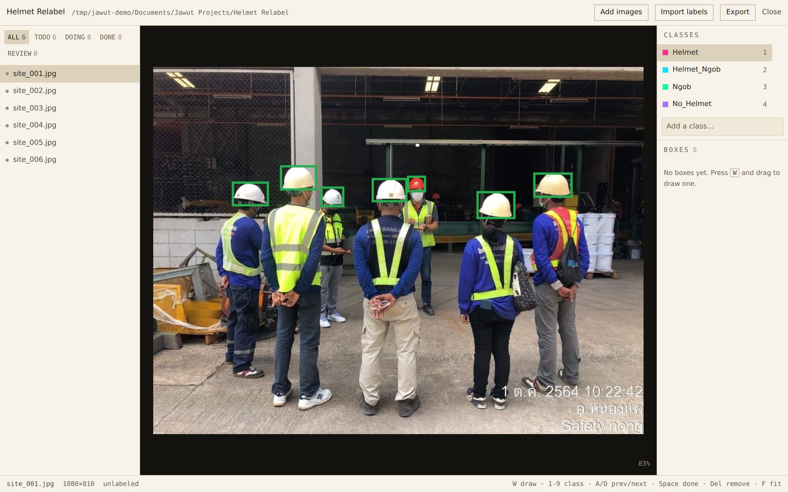

Each class gets a colour and a number. **The number is its keyboard shortcut.**
The first class is `1`, the second is `2`, and so on.

**The order matters at export time**, because it becomes the class index in the
exported dataset. It does not matter while you are labeling, and you can change it
later without breaking anything.

To rename a class, double-click it.

---

## Step 6 — Label

Select an image on the left, then:

1. Press **`W`**
2. Drag a box around the object
3. Press the **number key** for its class


Every box you draw appears in the list on the right, and the number beside the
filename on the left counts them.

### The keyboard is the whole job

Labeling a thousand images with the mouse alone is slow. These are worth learning —
they are also listed along the bottom of the window at all times.

| Key | What it does |
|---|---|
| `W` | Start drawing a new box |
| `1`–`9` | Set the class of the selected box |
| `A` / `D` | Previous / next image |
| `Space` | Mark this image finished and go to the next one |
| `Delete` | Delete the selected box |
| `F` | Fit the image to the window |
| `Esc` | Cancel drawing, or deselect |

### Adjusting a box

Click a box to select it. Eight small square handles appear on its edges and
corners — drag any of them to resize, or drag the middle of the box to move it.

Scroll the wheel to zoom, and drag the background to pan. Zooming in is worth doing
when a boundary is unclear; the image stays sharp rather than going blurry.

### Changing the class of a box

Two ways, both instant:

- Select the box and press its number key.
- Use the dropdown next to the box in the right-hand list.


### Images with nothing in them

If an image contains none of your classes, **press `Space` without drawing
anything**. That records "I looked at this, there is nothing here", which is real
and useful information — those become valid background images in the export.

This is different from never opening the image at all, and the two are exported
differently. Skipping an image is not the same as clearing it.

---

## Step 7 — Track your progress

Every image is in one of four states, shown as a coloured dot and counted in the
filter buttons at the top left.

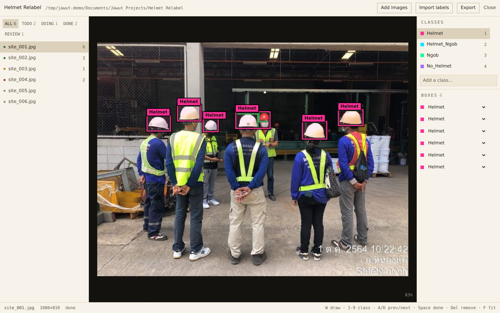

| Filter | Dot | Meaning |
|---|---|---|
| **Todo** | grey | Nobody has opened this image yet |
| **Doing** | amber | It has boxes, but has not been marked finished |
| **Done** | green | Finished — either boxed, or confirmed empty |
| **Review** | red | Flagged, or something the importer could not read |

Click a filter to show only those images. The arrow keys then move only within that
set, so filtering to **Todo** and pressing `D` walks you through exactly the work
that is left.

---

## Step 8 — Bringing in labels you already have

If you already have YOLO `.txt` labels — from a previous tool, or a colleague, or
an earlier attempt — you do not have to start over.

This is for adding labels to a project that already exists. If you have not made the
project yet, **Open existing dataset** on the welcome screen does this and the import
in one step.

Click **Import labels** and browse to the folder holding the `.txt` files.

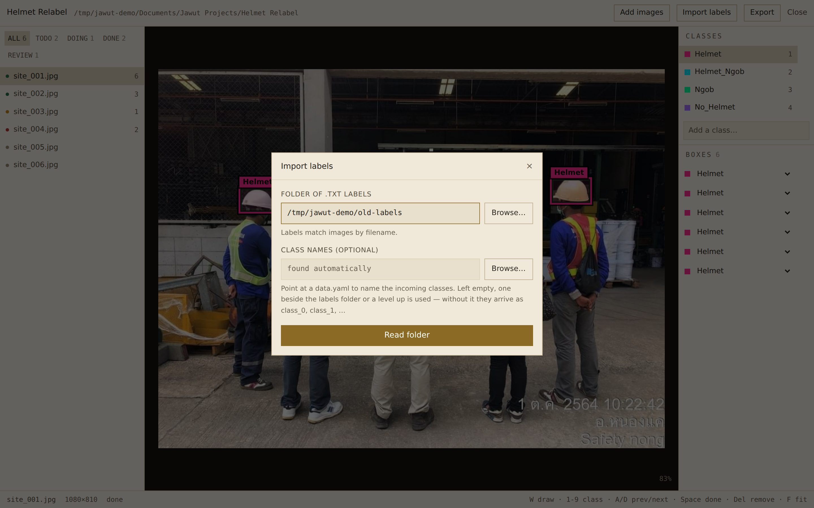

Labels are matched to images **by filename**: `site_004.txt` belongs to
`site_004.jpg`.

**Class names** are read from a `data.yaml` sitting beside the labels folder or one
level above it. If yours is somewhere else — which is common, since the config often
lives at the top of a dataset while the labels are two folders down — use the second
**Browse…** to point straight at it. Without one, the incoming classes are named
`class_0`, `class_1`, … and you have to remember which was which.

Click **Read folder**. Nothing has been changed yet — this only reads and reports.

### Mapping the classes

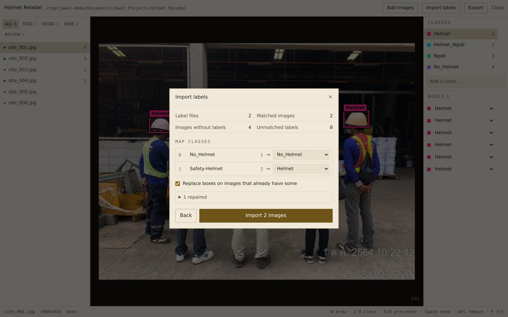

This is the important part. The old labels have their own class names, and you decide
where each one lands. For each incoming class you can:

- **Map it to one of your classes** — the count beside the name tells you how many
  boxes will move.
- **Create it as a new class** — the default when the name does not already exist.
- **Ignore it** — those boxes are not imported.

Two old classes can map to the same new class, which is how you merge categories.

The summary above shows how many label files were found, how many matched an image,
and how many labels had no matching image at all.

Click the expander at the bottom to see every issue the importer found, each with its
file and line number. It reports two kinds:

- **Repaired** — something it could fix unambiguously and did. Coordinates given in
  pixels instead of 0–1, values a hair outside the valid range, or extra data from a
  keypoint-labeling tool where the box itself is still perfectly good.
- **Rejected** — something it will not guess at. A line it cannot read, a class that
  is not in your mapping, or a box with no area.

**Nothing is ever discarded silently.** If a line did not become a box, it is in that
list with the reason.

### The result

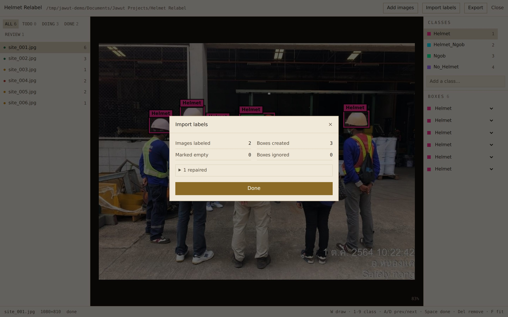

Images that received boxes become **Doing**. Images whose label file was empty become
**Done** — an empty label file means "reviewed, nothing here". Images whose labels
could not be read are marked **Review** so you can find them. Images with no label
file at all are left untouched.

---

## Step 9 — Changing your mind about classes

You can rename, reorder and delete classes at any point, including after you have
labeled thousands of images. Nothing breaks.

To delete a class, hover over it and click the **×**.

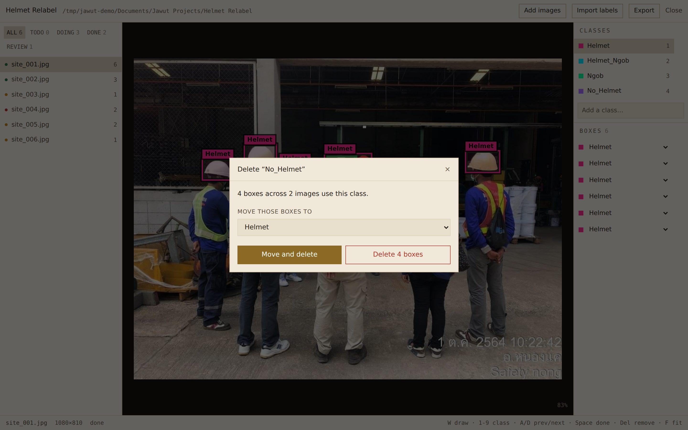

The dialog tells you exactly what it would cost — how many boxes, across how many
images — before you commit. Then you choose:

- **Move and delete** — the boxes are reassigned to another class and kept. Use this
  when you are merging two categories.
- **Delete the boxes** — the boxes go too. Use this when the category was a mistake.

Either way it happens in one go. It cannot half-finish and leave your project in a
strange state.

---

## Step 10 — Export

Click **Export**, and choose an empty folder to write to. **Browse…** to the folder
you want it to sit in, then add a new name on the end of the path — the destination
has to be empty or not exist yet.

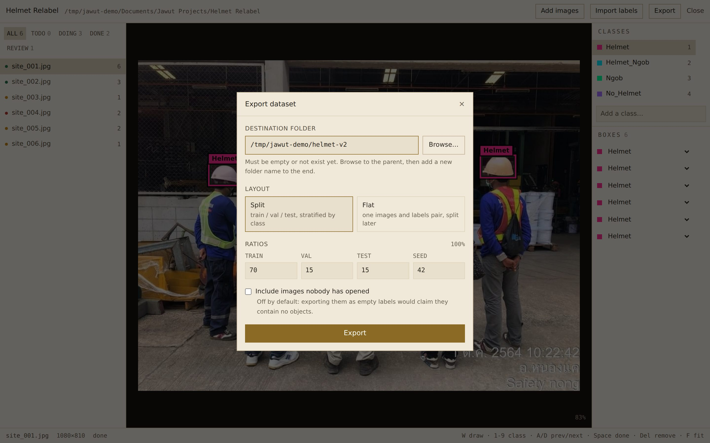

**Layout** — two choices:

- **Split** writes `train`, `val` and `test` folders, ready to train on directly.
  The default 70/15/15 is a reasonable starting point. The split is *stratified*,
  which means a class you have very few examples of is spread across the splits
  rather than landing entirely in one — otherwise its validation numbers would mean
  nothing.
- **Flat** writes one `images` and `labels` pair with no split, for when you would
  rather divide it yourself later.

**Seed** — the same seed always produces the same split. Leave it alone unless you
have a reason, and write it down if you do.

**Include images nobody has opened** — leave this off. Exporting an untouched image
would claim it contains no objects, which nobody has actually checked.

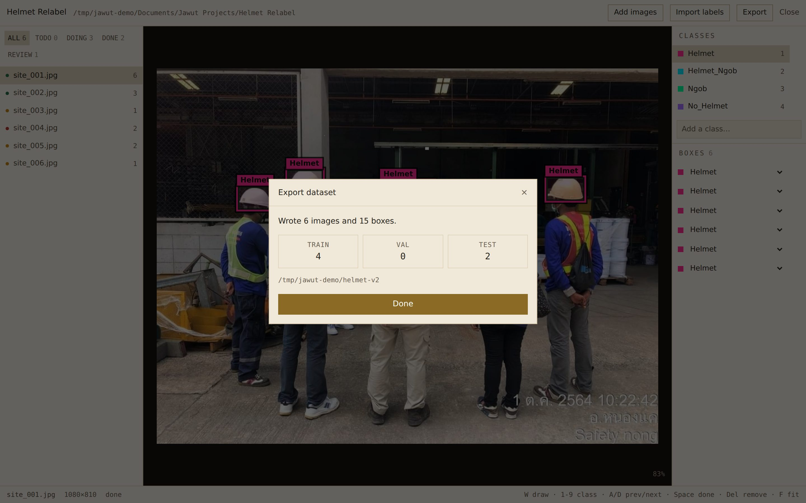

### What you get

```
data.yaml                 class names and where the splits are
train/images   train/labels
val/images     val/labels
test/images    test/labels
export_manifest.json      seed, ratios, and which image went where
```

Each label file holds one line per box: the class number, then the centre, width and
height of the box as fractions between 0 and 1. Standard YOLO — any training script
will read it.

**Keep `export_manifest.json`.** It records exactly how this dataset was built, which
is what lets you reproduce or check it months later.

---

## Where everything is kept

| What | Where |
|---|---|
| The application | Wherever you extracted the zip |
| Settings and your recent projects | `%APPDATA%\Jawut\` |
| Your projects | The folder you chose, by default `Documents\Jawut Projects\` |

---

## If something goes wrong

**An image will not display.** If it was imported with *Copy into the project*
turned off and the original file has since moved or been deleted, it cannot be
found. Import it again from its new location.

**The export refuses to run.** The destination folder has to be empty. Writing into
a folder that already holds a dataset would partly overwrite it, and you would only
find out when training gave strange results.

**A class count looks wrong after importing labels.** Check the mapping you chose.
You can import the same folder again with *Replace boxes on images that already have
some* turned on, which redoes that part cleanly.

**Your class counts look lopsided in the export.** Open `export_manifest.json` and
look at the per-image list. A class with almost nothing in it usually means a
mapping mistake rather than a labeling one.

---

## The short version

**Starting from a folder that is already labeled:**

1. **Open existing dataset…**, **Browse…** to the folder
2. Check what it found, **Create project from this**
3. `W`, drag, number key. `Space` for the next one
4. **Export**, choose an empty folder, **Split**

**Starting from photographs and nothing else:**

1. **New project**, give it a name
2. **Add images**, **Browse…** to your folder
3. Type your class names on the right
4. `W`, drag, number key. `Space` for the next one
5. **Export**, choose an empty folder, **Split**
